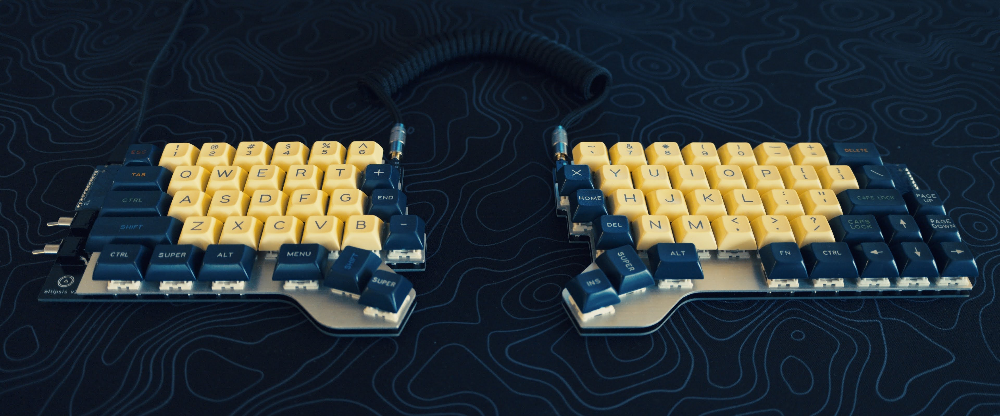

KiCad files for the pcb in the `pcb/` directory

dxf files for the plates in the `plates/` directory. This includes files for the templates used to cut out the wrist rests.

# V2 Construction Notes

The board is laid out for [this specific aliexpress promicro clone](https://www.aliexpress.us/item/2251801162485383.html?spm=a2g0o.order_list.order_list_main.5.74b51802ReslBv&gatewayAdapt=glo2usa&_randl_shipto=US). You can probably use a standard promicro, but the USB port will not be flush with the edge of the board.

The toggle switch used is the [E-Switch 100SP1T2B4M6QE](https://www.digikey.com/en/products/detail/e-switch/100SP1T2B4M6QE/378831?utm_medium=email&utm_source=oce&utm_campaign=4251_OCE22RT&utm_content=productdetail_US&utm_cid=3431001&so=79302515&mkt_tok=MDI4LVNYSy01MDcAAAGI5V8zllvVve2cTX5U4Xojm0RMn3Iq-sOntSVT2qtzfiGTsQoptobogo4Q5rgp82cGebamFCV9cWvPupQOrgY6sCrZjn-3Wv1uY3PDjv02). TBH I'd buy a clone of this off aliexpress too and save yourself a bunch of money.

Firmware source can be found [here](https://github.com/csun/qmk_firmware/tree/ellipsis_split_v2) on the `ellipsis_split_v2` branch.

# V1 Construction Notes

Most of the components needed for assembly should be properly labelled in the pcb files. The screen used is [this adafruit one](https://www.adafruit.com/product/931) based on the SSD1306 driver chip.

I cut wrist rests from wood using the router template included in the plates directory.

You'll also need M2 standoffs of various lengths to separate the two plates enough to fit the PCB. I think around 12mm is the minimum allowable height.

Firmware source uses QMK and can be found [here](https://github.com/csun/ellipsis_split_firmware)
